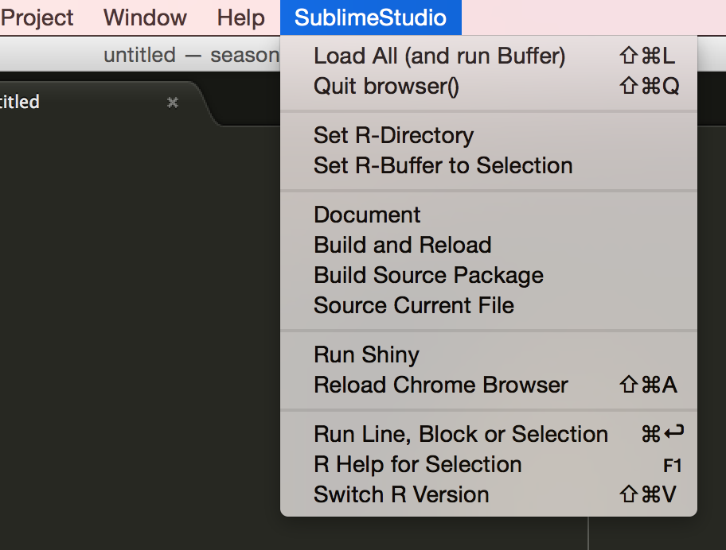

## SublimeStudio: Bringing the RStudio Experience to a Real Editor

A SublimeText plug-in that tries to bring parts of the user experience
in RStudio to SublimeText. It's designed to fulfill my personal needs, but you
may find it useful as a template for your own customizations. I borrowed the
sending-from-Sublime-to-R from RBox by Randyk (which is available through
package control).

https://github.com/randy3k/R-Box

### Features

- a prominent top level menu in SublimeStudio. You will love it (if R is your 
  main language), or hate it (otherwise).

- Support for different versions of R (or S-plus, or remote R sessions)

- An efficient debugging strategy

- Support for Windows and Mac 
  (i.e., no Linux, but you may a look at how this has been done in RBox.)

### Installation

- Download the zip folder.

- Move sublimestudio to your package folder. Here's how to find the package folder.

- Adjust the path to your R installation(s) in `SublimeStudio.sublime-settings`.

### The Sublime Studio Menu

The 'SublimeStudio' menu includes all functions offered by the plugin, the 
frequently functions sharing the same shortkeys as in RStudio:

### Debugging

For wild R debugging, I find the following strategy the most useful:

1) Mark the command you want to investigate and save it in the R-Buffer (by 
   right click.) 

2) Set browser() in your function. 

3) Press Ctrl/Cmd-Shift-L: This saves the file, re-loads the package (using
   devtools) und runs the buffer line, so that R will halt were you set the 
   browser. (Make sure you have the option `browserNLdisabled` set to `TRUE`; 
   otherwise new lines will quit the browser.)

4) After your changes, Press Ctrl/Command-Shift-Q to quit the browser and 
   Ctrl/Cmd-Shift-L to retry (or land at another browser position).

### Switching R Versions

This is very useful if you are using different Versions of R. Occasonally,
I also use S-plus with SublimeStudio, which helps me to forget that I use 
S-plus. I also added a terminal option (on) to work directly on a Linux server. If you want to set up your own Versions, you need to adjust the
Python code in sublimetext.py (it's easy and worth it!)

### Credits and Licence

Randyk, as mentioned. Autohotkey, which is included and used on Windows to transfer data from SublimeText to R. 

